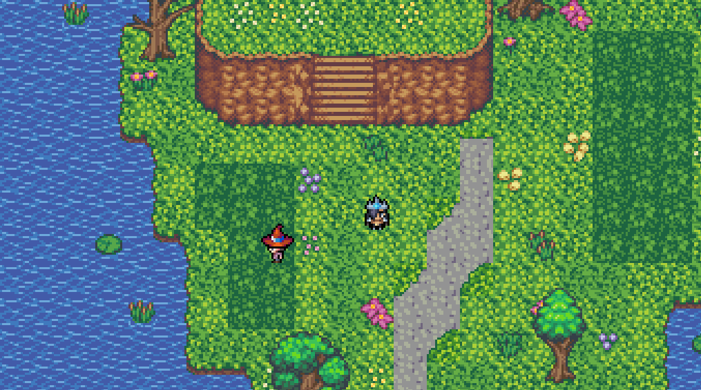

# starvimon
A mockup of a monster battling game inspired by Pokemon.

This was a mini-project aimed at learning some basics of widely used elements and patterns.

## Things I Learned

- How to setup a base ExpressJS application
- How to host an ExpressJS application on "https://railway.app/"
- How to load images in a safe way
- How to draw and move images on a HTML canvas
- How to work with the "scale" of the canvas
- How to create classes in Javascript
- How to use the "GSAP" library for easy animations
- How to use Javascript event listeners 

## Example Output

